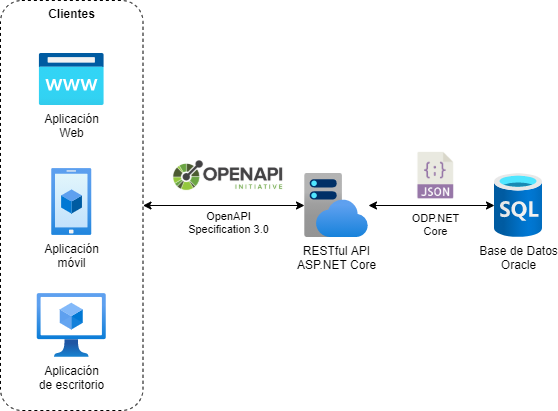
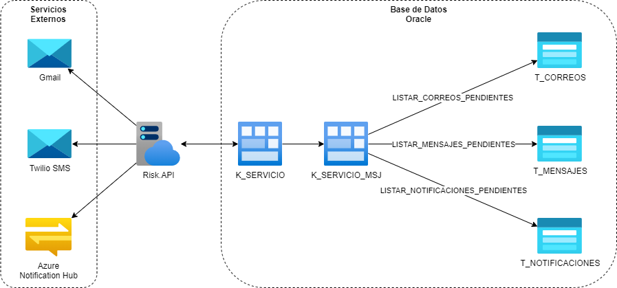

# Documentación

Bienvenido/a a la documentación del Proyecto RISK.

## Contenido
* [Arquitectura](#arquitectura)
* [Requerimientos](#requerimientos)
* [Instalación](#instalación)
* [Guía de estilo para Desarrollo](database/styleguide.md)
* [API PL/SQL](database/plsqldoc/index.html)
* [API Clientes de Risk.API](backend/README.md)

## Arquitectura
### General

### Mensajería

## Requerimientos
### Base de Datos
* [Oracle Database 12c o superior](https://www.oracle.com/database/technologies/xe-downloads.html)

### Back-End
* [.NET Core 3.1](https://dotnet.microsoft.com/download/dotnet-core/3.1)

Los servicios de mensajería del proyecto Risk.Msj tienen requerimientos especiales de terceros:

Servicio|Requerimiento
--------|-------------
Mail|Cuenta de Gmail configurada con autenticación [OAuth](https://github.com/jstedfast/MailKit/blob/master/GMailOAuth2.md) o acceso de [apps menos seguras](https://www.google.com/settings/security/lesssecureapps).
Push|Cuenta de Twilio configurada con el servicio [SMS](https://www.twilio.com/sms).
SMS|Cuenta de Azure configurada con el servicio [Notification Hubs](https://azure.microsoft.com/es-es/services/notification-hubs/).

## Instalación
### Base de Datos

Script|Descripción
------|-----------
compile_schema.sql|Compila objetos inválidos del esquema actual.
create_access_user.sql|Crea usuario y otorga permisos necesarios para llamar a los servicios del Proyecto RISK. Se debe ejecutar con SYS o SYSTEM.
create_code_user.sql|Crea usuario y otorga permisos necesarios para instalar los objetos de Base de Datos del Proyecto RISK. Se debe ejecutar con SYS o SYSTEM.
generate_docs.sql|Genera archivos de documentación de objetos de Base de Datos con la herramienta *plsqldoc*. Se debe ejecutar desde un Command Window de PL/SQL Developer con el plug-in *plsqldoc* instalado.
install.sql|Instala en el esquema actual los objetos de Base de Datos del Proyecto RISK.
install_audit.sql|Genera campos y triggers de auditoría.
install_dependencies.sql|Instala en el esquema actual las dependencias de terceros.
uninstall.sql|Desinstala del esquema actual los objetos de Base de Datos del Proyecto RISK.
uninstall_dependencies.sql|Desinstala del esquema actual las dependencias de terceros.

### Back-End